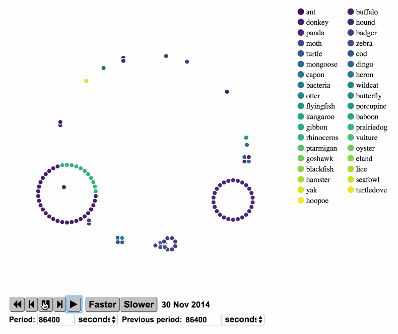
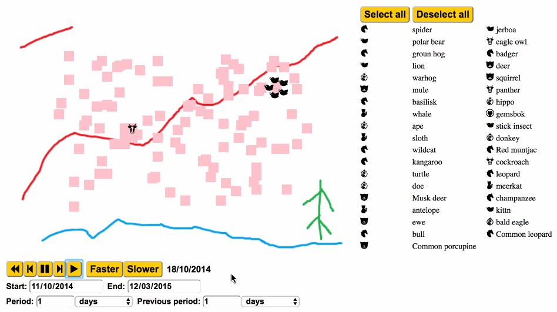
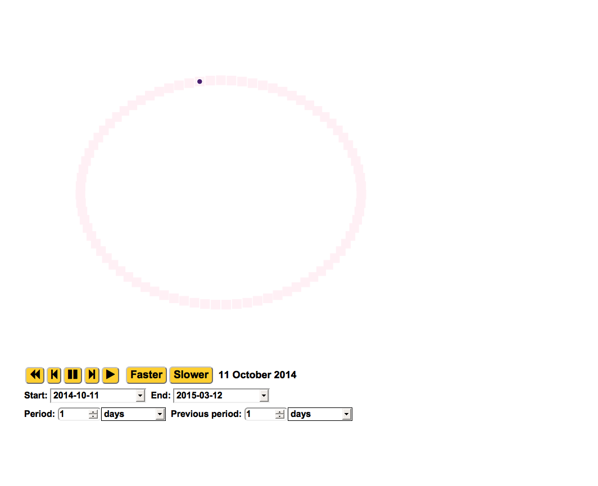

<!-- README.md is generated from README.Rmd. Please edit that file -->
eventsObserveR
==============

[](https://travis-ci.org/ox-it/eventsObserveR) []() [](https://codecov.io/gh/ox-it/eventsObserveR)

R wrapper for a D3 visualisation of event observations attached to specific "places".

An example visualisation is included below:

``` r
library(eventsObserveR)
library(plyr)
library(dplyr)
legend.df <- sample_events_data %>%
  select(event_type, color, event_type_id) %>%
  rename(description = event_type) %>%
  unique()
eventsObserveR(events = sample_events_data, 
               place.key = "station",
               legend = legend.df,
               legend.columns = 2)
```

</img>

The package allows for significant customisation, for instance:

</img>

Installation
============

This package is not available from CRAN, you must install it from Github as follows:

``` r
if (!require('devtools')) install.packages('devtools')
devtools::install_github('ox-it/eventsObserveR')
```

Documentation
=============

The simplest usage of `eventsObserveR` is to visualise the distribution of events at places without specified coordinates, using the built-in dataset

``` r
library(eventsObserveR)
library(plyr)
library(dplyr)
eventsObserveR(events = sample_events_data,
               place.key = "station")
```



Overview
========

This package was developed by Ken Kahn and Martin Hadley in IT Services at Oxford University for a case study in the Live Data project, see the [Oxford Interactive Data Network](idn.web.ox.ac.uk) website for further details.

Orignally, we were interested in creating a one time interactive visualisation inspired by the stunning [A Day in the Life of Americans](https://flowingdata.com/2015/12/15/a-day-in-the-life-of-americans/) from the excellt [flowingdata.com](flowingdata.com) website. This visualisation show a number of different activities (or places, in the `eventsOberserR` verbiage) that people (one dot representing a single individual) move between during the day.

However, the data we visualised represented a much more complicated data set which looks something like this pretend dataset:

| Station |     Day    |  Time | Animal | Count | Male | Female |
|---------|:----------:|:-----:|:------:|:-----:|:----:|:------:|
| A       | 2010/01/02 | 14:00 |   ant  |   5   |   3  |    2   |
| A       | 2010/01/02 | 14:05 |   ant  |   7   |   1  |    4   |
| A       | 2010/01/03 | 14:00 |   ant  |   10  |   6  |    5   |

Our data came from a field study including over 50 cameras at 25 different locations over a multi-month period, with images taken by the cameras whenever movement was detected. Researchers then identified animals (and gender, where possible) from these images and compiled data similar to the table above. However, we could not guarantee that the ants at on 2010/01/01 14:00 and 5 minutes later were the same ants, it was therefore not possible to exactly replicate the [A Day in the Life of Americans](https://flowingdata.com/2015/12/15/a-day-in-the-life-of-americans/) flow visualisation.

We therefore create a visualisation that represented the number of individuals at each place (station) within a certain period of time, represented by dots clustered around a specific place for each observation within that period. Additionally, the user could select a "previous viewing window" that was also of interest; dots belonging to the previous period would be hollow dots.

For the toy example above, consider the following settings:

-   Period: 1 day
-   Previous Period: 1 day
-   Viewing Date: 2010/01/03

The following would be shown in the visualisation:

-   One filled dot around station A representing the single observation of 10 ants

-   Two hollow dots representing the two separate observations of ants the previous day.

We developed this htmlwidget to display this type of data, extending the functionality to support fixed positions of "places" or else the library will fill the `interface.width` and `interface.height` with a circle comprised of dots for each unique location.
